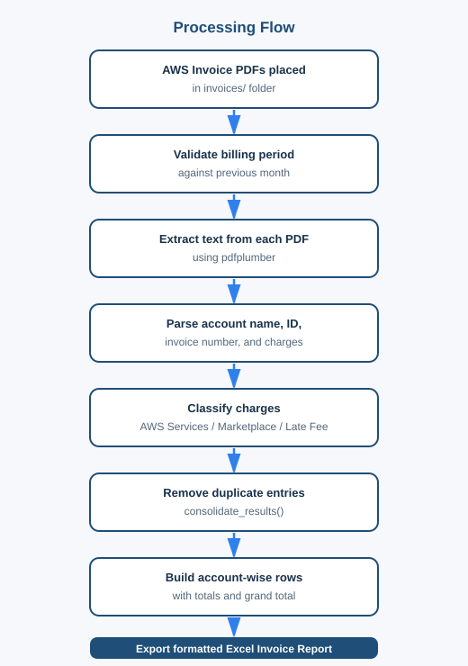
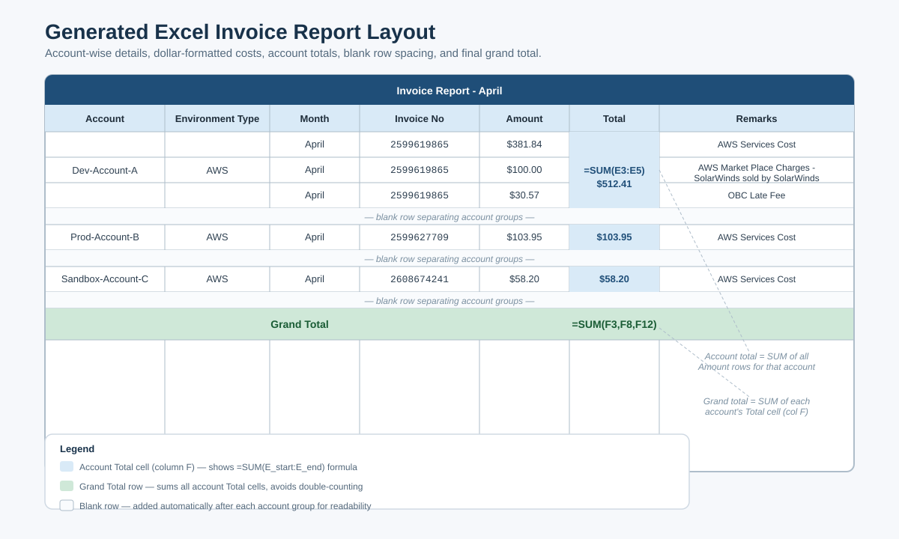
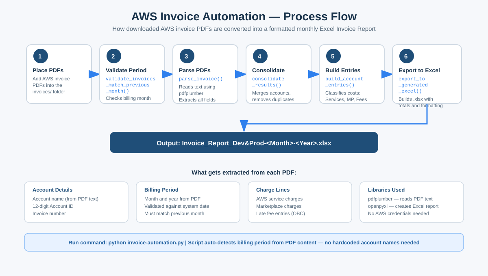
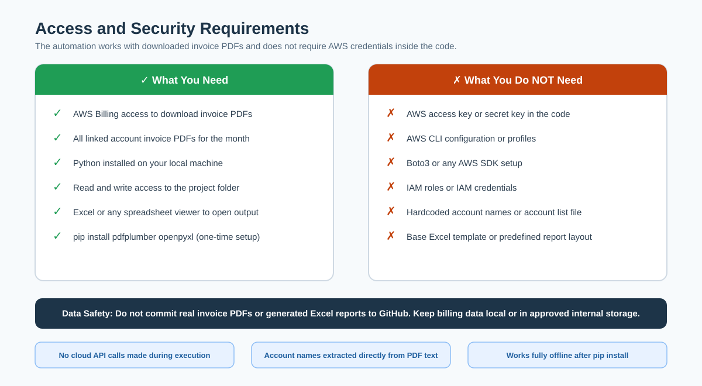
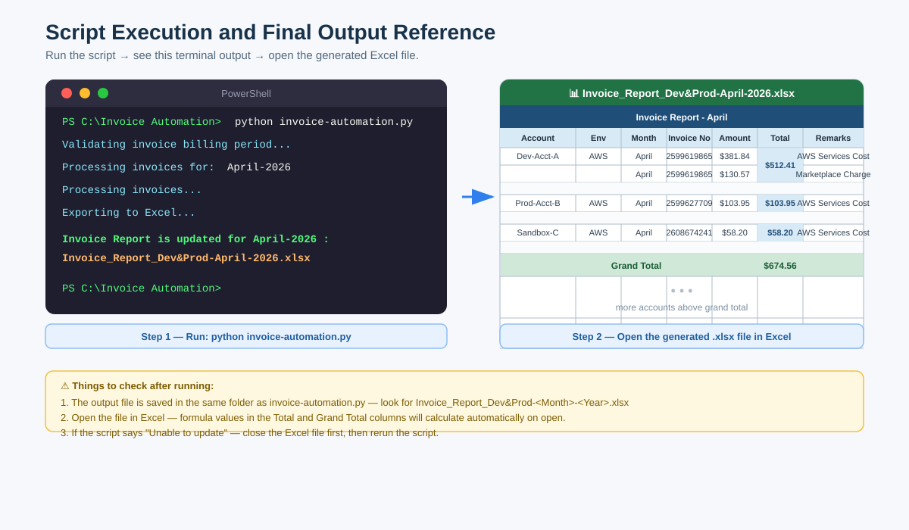
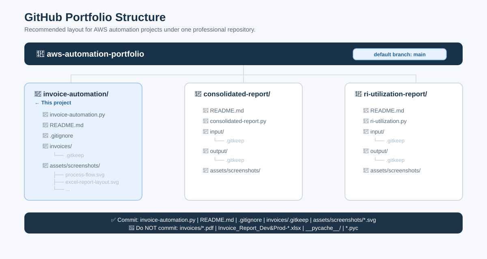

# AWS Invoice Automation Using Python

> Automated extraction of AWS Invoice PDFs and generation of a formatted Excel Invoice Report

| | |
|---|---|
| **Author** | Hima Varsha M |
| **Project** | AWS Invoice Automation |
| **Primary Script** | `invoice-automation.py` |
| **Output** | Monthly AWS Invoice Report — `.xlsx` format |
| **Audience** | Delivery leads, finance coordinators, cloud operations teams, and automation reviewers |

---

## Table of Contents

1. [Executive Summary](#1-executive-summary)
2. [Business Value](#2-business-value)
3. [Access and Permissions](#3-access-and-permissions)
4. [Security and Data Handling](#4-security-and-data-handling)
5. [Repository Structure](#5-repository-structure)
6. [Technical Prerequisites](#6-technical-prerequisites)
7. [Input Requirements](#7-input-requirements)
8. [How to Run](#8-how-to-run)
9. [Processing Flow](#9-processing-flow)
10. [Output Report Details](#10-output-report-details)
11. [Supporting Visuals](#11-supporting-visuals)
12. [Cost Calculation Logic](#12-cost-calculation-logic)
13. [Charge Classification Rules](#13-charge-classification-rules)
14. [Billing Period Validation](#14-billing-period-validation)
15. [Dynamic Environment Support](#15-dynamic-environment-support)
16. [Operational Controls](#16-operational-controls)
17. [Troubleshooting](#17-troubleshooting)
18. [GitHub Publishing Guidelines](#18-github-publishing-guidelines)
19. [Function Reference](#19-function-reference)
20. [Ownership](#20-ownership)
21. [Conclusion](#21-conclusion)

---

## 1. Executive Summary

Monthly AWS invoice reporting requires extracting account-wise costs, Marketplace charges, invoice numbers, and late fee details from multiple PDF files. Done manually, this process is repetitive, time-consuming, and prone to copy-paste errors.

This project automates the entire workflow using Python. The script reads AWS invoice PDFs, extracts billing details, classifies charges, calculates account-level totals, and produces a formatted Excel Invoice Report — ready for review and distribution.

The solution requires no hardcoded account names, no static account list, and no predefined Excel template. All account information is extracted directly from the invoice PDFs, making the automation reusable across any AWS environment or billing structure.

---

## 2. Business Value

This automation improves the speed, consistency, and accuracy of monthly invoice reporting.

| Benefit | Description |
|---|---|
| Saves time | Eliminates manual data extraction from multiple PDF files |
| Reduces errors | Removes dependency on manual copy-paste and formula entry |
| Dynamic extraction | Account names are read directly from PDF content |
| Charge separation | AWS Services, Marketplace, and Late Fee entries are classified separately |
| Accurate totals | Account-level totals and a final grand total are calculated automatically |
| Consistent output | Every run produces the same structured Excel format |
| Secure by design | Invoice PDFs and reports are excluded from GitHub via `.gitignore` |

---

## 3. Access and Permissions

The script does not connect to AWS directly. It processes invoice PDFs that have already been downloaded from the AWS Billing console.

### What You Need

| Access | Purpose |
|---|---|
| AWS Billing console access | To download monthly invoice PDFs |
| All linked account invoice PDFs | To ensure complete account-wise reporting |
| Local Python runtime | To execute the script |
| Read and write access to the project folder | To read PDFs and save the Excel output |
| Excel or any spreadsheet viewer | To open and review the generated report |
| Internet access (setup only) | To install required Python packages |

### What You Do Not Need

The script does **not** require any of the following:

- AWS access key or secret key
- IAM credentials or IAM roles
- AWS CLI configuration
- Boto3 or any AWS SDK
- Hardcoded account names or an account list file

---

## 4. Security and Data Handling

AWS invoice PDFs and generated Excel reports contain sensitive billing information, account IDs, and cost details.

**Recommended practices:**

- Do not commit real invoice PDFs to GitHub
- Do not commit generated Excel reports to GitHub
- Store invoice files locally or in approved internal storage only
- Share generated reports only with authorized stakeholders
- Review your organization's data policy before publishing any screenshots or sample outputs

The `.gitignore` file included in this project is pre-configured to prevent invoice PDFs and Excel reports from being committed accidentally.

---

## 5. Repository Structure

```text
Invoice Automation/
├── invoice-automation.py
├── README.md
├── .gitignore
├── invoices/
│   └── .gitkeep
├── sample-invoices/
│   ├── Invoice_DEMO0000001.pdf
│   ├── Invoice_DEMO0000002.pdf
│   └── Invoice_DEMO0000003.pdf
├── assets/
│   └── screenshots/
│       ├── process-flow.svg
│       ├── access-and-security.svg
│       ├── excel-report-layout.svg
│       ├── final-output.svg
│       └── github-portfolio-structure.svg
└── Invoice_Report_Dev&Prod-<Month>-<Year>.xlsx
```

### File and Folder Reference

| File or Folder | Description |
|---|---|
| `invoice-automation.py` | Main Python automation script |
| `README.md` | Full project documentation |
| `.gitignore` | Prevents real invoice PDFs and Excel reports from being committed |
| `invoices/` | Input folder — place real AWS invoice PDFs here before running |
| `invoices/.gitkeep` | Keeps the empty folder tracked in GitHub |
| `sample-invoices/` | Sample dummy invoice PDFs with fake data — safe to push to GitHub |
| `assets/screenshots/` | SVG visuals used in this README |
| `Invoice_Report_Dev&Prod-<Month>-<Year>.xlsx` | Generated Excel report — saved in the project root, not committed |

---

## 6. Technical Prerequisites

Install Python before running the script. Then install the required packages using the command below.

```powershell
pip install pdfplumber openpyxl
```

### Package Reference

| Package | Purpose |
|---|---|
| `pdfplumber` | Reads and extracts text content from AWS invoice PDFs |
| `openpyxl` | Creates, formats, and saves the Excel Invoice Report |

No database, cloud API, AWS SDK, or external service is required.

> **Note:** If you want to regenerate the sample dummy invoices in `sample-invoices/`, install `reportlab` additionally and run `generate_dummy_invoices.py`. This is optional and not required to run the main automation.

---

## 7. Input Requirements

Place all AWS invoice PDFs for the billing month inside the `invoices/` folder before running the script.

**Requirements:**

- Files must be in `.pdf` format
- PDFs must be readable and not password-protected
- All PDFs must belong to the same billing period
- The billing period must match the previous calendar month relative to the current system date
- The PDF text format must be consistent with standard AWS invoice layout

**Example folder contents:**

```text
invoices/
├── Invoice_123456789.pdf
├── Invoice_987654321.pdf
└── Invoice_112233445.pdf
```

> **Sample invoices:** The `sample-invoices/` folder contains dummy PDFs with fake data that match the expected invoice format. Use them to understand the input structure before running with real invoices.

---

## 8. How to Run

Open a terminal in the project folder and run:

```powershell
python invoice-automation.py
```

**Expected console output:**

```text
Validating invoice billing period...
Processing invoices for: April-2026
Processing invoices...
Exporting to Excel...
Invoice Report is updated for April-2026 : Invoice_Report_Dev&Prod-April-2026.xlsx
```

> **Note:** If the Excel output file is already open in Excel, close it before rerunning the script. The script cannot overwrite an open file.

---

## 9. Processing Flow

<div align="center">



</div>

---

## 10. Output Report Details

The generated Excel file is saved in the project root folder with the naming pattern:

```text
Invoice_Report_Dev&Prod-<Month>-<Year>.xlsx
```

### Column Structure

| Column | Header | Description |
|---|---|---|
| A | Account | Account name extracted from the invoice PDF |
| B | Environment Type | Set to `AWS` for all rows |
| C | Month | Billing month name |
| D | Invoice No | Invoice number extracted from the PDF |
| E | Amount | Individual charge line amount |
| F | Total | Account-level total (SUM formula) or grand total |
| G | Remarks | Charge type — AWS Services Cost, Marketplace, or Late Fee |

### Formatting Details

| Format Rule | Description |
|---|---|
| Cell alignment | All cells are center-aligned horizontally and vertically |
| Currency format | Columns E and F use `$#,##0.00` dollar format |
| Merged cells | Account name (col A), Environment (col B), and Total (col F) are merged across account rows |
| Blank row | One blank row is inserted after each account group |
| Account total | Column F shows `=SUM(E_start:E_end)` for each account group |
| Grand total | Final row shows `=SUM(F3,F8,...)` summing all account totals |
| Header styling | Row 1 uses dark blue fill with white bold text |
| Column headers | Row 2 uses light blue fill with bold text |
| Grand total row | Uses green fill with bold text |
| Freeze panes | Row 1 and 2 are frozen for easy scrolling |

<div align="center">



</div>

---

## 11. Supporting Visuals

The visuals below explain the workflow, security posture, report structure, and execution output. They are designed so that freshers and first-time reviewers can understand the project without reading the code.

> **Note:** Do not publish real invoice PDFs or reports containing actual billing data. Use masked or sample values before sharing publicly.

---

### Visual 1 — Automation Process Flow

Shows the complete 6-step workflow from placing invoice PDFs in the input folder to saving the final Excel report. Each step card includes the corresponding Python function name so freshers can map the visual directly to the code.



---

### Visual 2 — Access and Security Overview

Side-by-side checklist showing exactly what access is required and what is not required. Confirms that no AWS credentials, CLI setup, or Boto3 configuration is needed inside the code.



---

### Visual 3 — Excel Report Layout

Shows the exact structure of the generated Excel report with sample data. Includes the title row, column headers, account rows with merged cells, SUM formulas in column F, blank row spacing between account groups, and the final grand total row. A legend explains each color and formatting rule.


---

### Visual 4 — Script Execution and Final Output Reference

Shows the exact terminal output when the script runs successfully on the left, and a preview of the generated Excel report on the right. Freshers can use this to know exactly what to expect before and after running the automation.



---

### Visual 5 — GitHub Portfolio Structure

Shows how this automation fits into the broader `aws-automation-portfolio` repository alongside other AWS automation projects. Highlights which files to commit and which to exclude.



---

### Visual Folder Reference

```text
assets/
└── screenshots/
    ├── process-flow.svg
    ├── access-and-security.svg
    ├── excel-report-layout.svg
    ├── final-output.svg
    └── github-portfolio-structure.svg
```

---

## 12. Cost Calculation Logic

### Account-Level Total

Each account section can contain one or more charge lines. The script writes a SUM formula in column F that covers all amount rows for that account.

**Example — account with 3 charge lines starting at row 3:**

```excel
=SUM(E3:E5)
```

### Grand Total

The grand total is calculated by summing the account total cells from column F — not the individual amount cells. This avoids double-counting.

**Example:**

```excel
=SUM(F3,F7,F11,F15)
```

Each cell reference points to the first row of an account group where the account total formula is written.

---

## 13. Charge Classification Rules

The script reads each charge line from the invoice PDF and assigns a remark based on the charge type.

| Charge Type | Remark Written in Column G |
|---|---|
| Standard AWS service usage | `AWS Services Cost` |
| AWS Marketplace product | `AWS Market Place Charges - <product name>` |
| Late payment fee | `OBC Late Fee` |

**Deduplication rules applied:**

- Duplicate AWS service entries are removed
- Duplicate Marketplace entries are removed
- Duplicate late fee entries are removed
- Marketplace charges are excluded from the AWS Services Cost calculation

---

## 14. Billing Period Validation

Before processing any PDF, the script validates that all invoices belong to the expected billing period.

The expected billing period is always the **previous calendar month** based on the local system date.

**Example:**

| Script Run Month | Expected Billing Period |
|---|---|
| May 2026 | April-2026 |
| June 2026 | May-2026 |
| January 2026 | December-2025 |

If any invoice has a different billing period, the script stops immediately and prints the mismatch details. No Excel file is generated until all invoices pass validation.

---

## 15. Dynamic Environment Support

The script is built to work across any AWS account structure without any configuration changes.

**It does not require:**

- Hardcoded account names
- An `accountnames.txt` file
- A base Excel template
- A fixed account order
- A fixed number of accounts

The report is built entirely from the invoice PDF content on each run.

**Suitable for:**

- Development, staging, production, and sandbox environments
- Single-account and multi-account AWS organizations
- Different teams, business units, or billing structures

---

## 16. Operational Controls

The script includes built-in safeguards to ensure reliable and consistent execution.

| Control | Behavior |
|---|---|
| No PDFs found | Script stops and prints an error message |
| Billing period mismatch | Script stops and prints which file failed validation |
| PDF parse failure | Script logs the error and continues with remaining PDFs |
| Duplicate entries | Removed automatically before building the report |
| Excel file open | Script raises a clear error asking you to close the file |
| Output file naming | Named automatically using the billing month and year |
| GitHub safety | `.gitignore` prevents PDFs and Excel reports from being committed |

---

## 17. Troubleshooting

| Issue | Likely Cause | Resolution |
|---|---|---|
| `No PDF invoices found` | The `invoices/` folder is empty | Add the correct invoice PDFs to the folder |
| `Billing period validation failed` | Invoice month does not match the expected previous month | Use invoice PDFs for the correct billing period |
| `Unable to update .xlsx` | The Excel output file is open | Close the file in Excel and rerun the script |
| `ModuleNotFoundError` | Required package is not installed | Run `pip install pdfplumber openpyxl` |
| Missing charge lines in output | Invoice PDF format may have changed | Review the PDF text structure against the parser patterns |
| Total column shows formula text | Excel has not recalculated | Open the file in Excel — formulas calculate automatically on open |

---

## 18. GitHub Publishing Guidelines

### Files to Commit

```text
invoice-automation.py
README.md
.gitignore
invoices/.gitkeep
sample-invoices/Invoice_DEMO0000001.pdf
sample-invoices/Invoice_DEMO0000002.pdf
sample-invoices/Invoice_DEMO0000003.pdf
assets/screenshots/process-flow.svg
assets/screenshots/access-and-security.svg
assets/screenshots/excel-report-layout.svg
assets/screenshots/final-output.svg
assets/screenshots/github-portfolio-structure.svg
assets/screenshots/console-output.svg
```

### Files to Exclude

```text
invoices/Invoice_<real-invoice-number>.pdf
Invoice_Report_Dev&Prod-*.xlsx
generate_dummy_invoices.py
__pycache__/
*.pyc
```

> **Important:** Real invoice PDFs with actual billing data must never be committed. Only the dummy PDFs in `sample-invoices/` are safe to push. The `generate_dummy_invoices.py` script is a local utility and should not be committed.

---

## 19. Function Reference

| Function | Purpose |
|---|---|
| `validate_invoices_match_previous_month()` | Validates that all invoice PDFs belong to the expected billing period |
| `parse_invoice()` | Extracts account details and charge lines from a single PDF |
| `process_all_invoices()` | Runs `parse_invoice()` across all PDFs using parallel processing |
| `consolidate_results()` | Merges results from all PDFs and removes duplicate entries |
| `build_account_entries()` | Classifies charges and builds report-ready rows per account |
| `export_to_generated_excel()` | Creates the formatted Excel report and saves it to disk |

---

## 20. Ownership

This project — including the automation logic, source code, report generation workflow, and all documentation — is owned by **Hima Varsha M**.

It is prepared for professional portfolio usage, internal demonstration, GitHub publication, and technical documentation.

---

## 21. Conclusion

This AWS Invoice Automation project delivers a reliable and reusable solution for monthly invoice reporting. It eliminates manual effort, enforces consistent formatting, and produces a structured Excel Invoice Report directly from AWS invoice PDFs — with no AWS credentials, no hardcoded values, and no manual intervention required.

The project is suitable for professional review and portfolio presentation. It demonstrates practical Python automation, clean code structure, billing data classification, Excel report generation, and responsible data handling practices.
