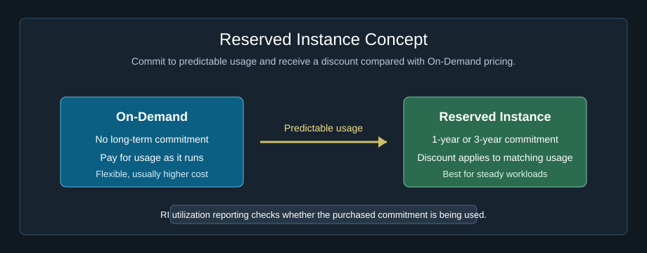
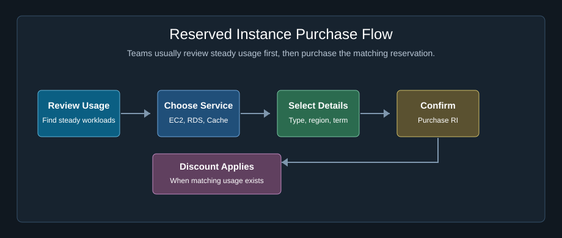
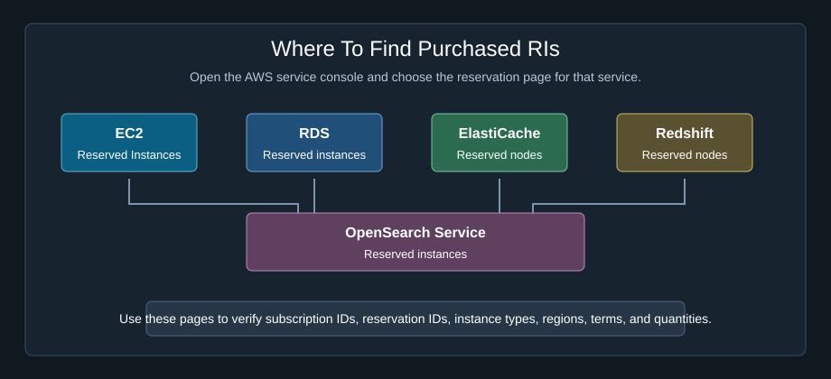
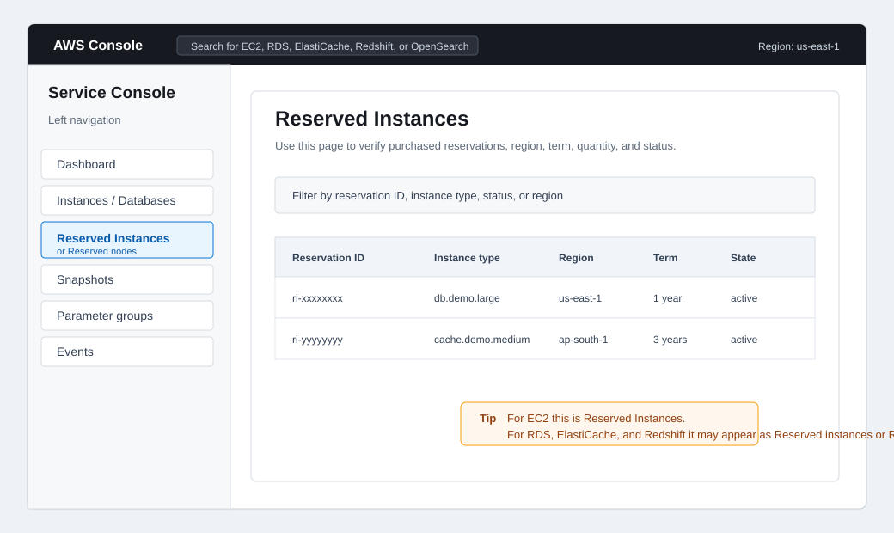
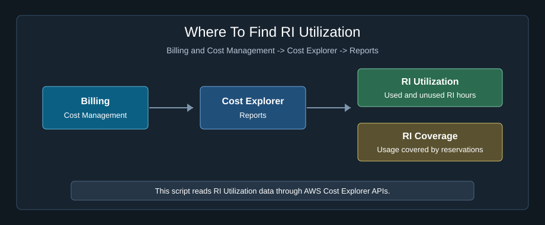
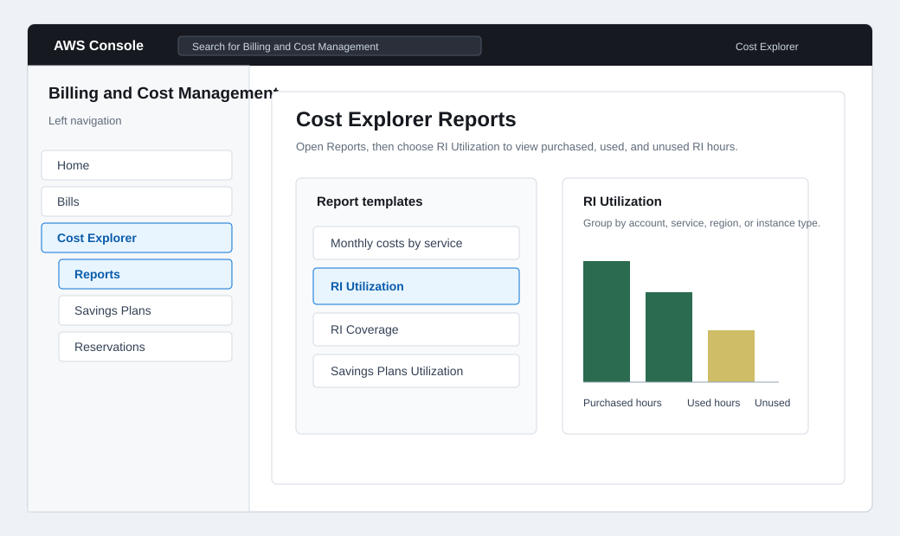
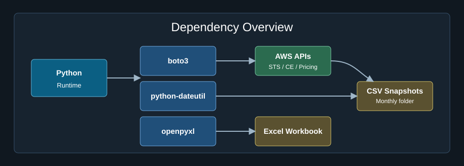
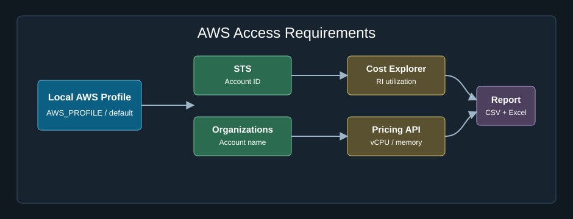
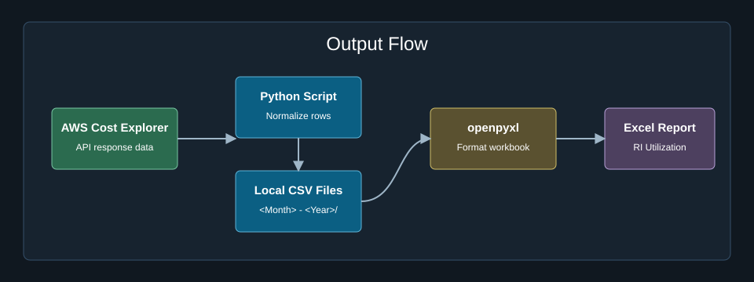
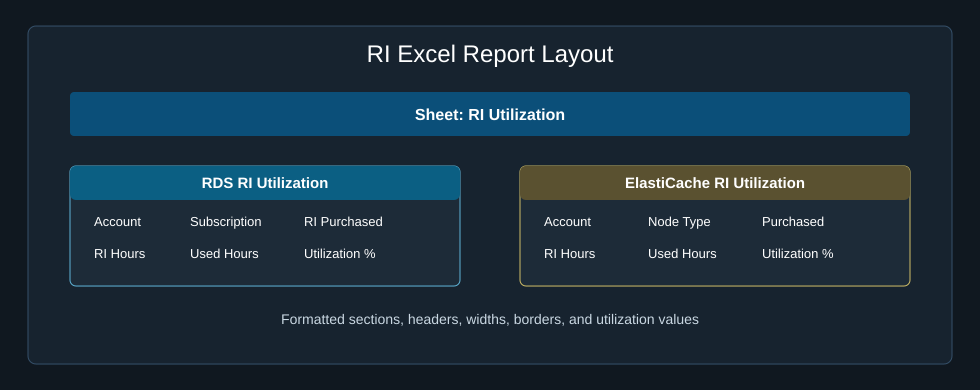

# AWS RI Utilization Report Automation

> Beginner-friendly Python automation to fetch AWS Reserved Instance utilization data, create local CSV snapshots, and generate a formatted Excel report.

| | |
|---|---|
| **Author** | Hima Varsha M |
| **Script** | `utilization-automation.py` |
| **Demo Excel** | `demo-reservations-utilization-report.xlsx` |
| **Demo CSV Folder** | `demo-April - 2026/` |

---

## 1. What Is A Reserved Instance?

A Reserved Instance, commonly called an RI, is an AWS billing discount option.

Normally, when you run AWS resources, you pay On-Demand pricing. On-Demand means you pay for what you use without any long-term commitment.

With a Reserved Instance, you commit to using a specific type of resource for a fixed period. In return, AWS gives a discounted price compared with On-Demand usage.

| Option | Meaning |
|---|---|
| On-Demand | Pay for usage without commitment |
| Reserved Instance | Commit for a term and receive a discount |

For freshers, think of it like this:

- On-Demand is like paying daily rent.
- Reserved Instance is like booking for a longer period and getting a discount.

RIs are useful when the resource runs continuously or predictably.

Common examples:

- Production databases
- Application cache clusters
- Long-running compute workloads
- Stable environments that do not change often

<div align="center">



</div>

---

## 2. How Reserved Instances Are Purchased

Before purchasing an RI, a cloud or FinOps team usually checks past AWS usage. The goal is to identify resources that are running regularly and are good candidates for reservation.

Important purchase decisions:

| Decision | Example |
|---|---|
| AWS service | Amazon RDS, Amazon ElastiCache, Amazon EC2 |
| Instance or node type | `db.demo.large`, `cache.demo.medium` |
| Region | `us-east-1`, `ap-south-1` |
| Term | 1 year or 3 years |
| Payment option | No Upfront, Partial Upfront, All Upfront |
| Quantity | Number of reserved instances or nodes |

High-level purchase flow:

1. Open the AWS service where reservation is needed, such as Amazon RDS or Amazon ElastiCache.
2. Go to the Reserved Instances or Reserved Nodes section.
3. Choose the instance or node type.
4. Select the Region.
5. Select the term, such as 1 year or 3 years.
6. Select the payment option.
7. Enter the quantity.
8. Review the cost and discount.
9. Confirm the purchase.

After purchase, AWS automatically applies the RI discount when matching usage is found.

<div align="center">



</div>

---

## 3. Where To Find Reserved Instances In AWS

Reserved Instances can be checked in two common places:

1. The individual AWS service console, where the reservation was purchased.
2. AWS Cost Explorer, where utilization and coverage reports are available.

### Service Console Locations

Use the service console when you want to see the actual purchased reservation, subscription, offering, region, term, and quantity.

| AWS Service | Where To Find It In AWS Console | What You Can Check |
|---|---|---|
| Amazon EC2 | EC2 console -> Reserved Instances | EC2 RI ID, instance type, scope, term, state, start date, end date |
| Amazon RDS | RDS console -> Reserved instances | DB instance class, region, offering type, term, fixed price, usage price |
| Amazon ElastiCache | ElastiCache console -> Reserved nodes | Reserved node ID, node type, engine, term, offering type |
| Amazon Redshift | Redshift console -> Reserved nodes | Reserved node type, node count, term, offering type |
| Amazon OpenSearch Service | OpenSearch Service console -> Reserved instances | Instance type, reservation term, payment option, quantity |

<div align="center">



</div>

### AWS Console Navigation Example

The image below shows the type of AWS console navigation to use when checking purchased reservations from each service.

<div align="center">



</div>

### Cost Explorer Locations

Use Cost Explorer when you want to check whether purchased reservations are being used.

| Report | AWS Console Path | Used For |
|---|---|---|
| RI Utilization | Billing and Cost Management -> Cost Explorer -> Reports -> RI Utilization | Shows purchased, used, and unused RI hours |
| RI Coverage | Billing and Cost Management -> Cost Explorer -> Reports -> RI Coverage | Shows how much eligible usage is covered by reservations |

<div align="center">



</div>

The image below shows where the RI Utilization report appears inside Cost Explorer reports.

<div align="center">



</div>

This automation uses Cost Explorer RI utilization data. The service consoles are useful for verifying the original reservations, while Cost Explorer is useful for monthly utilization reporting.

AWS documentation references:

- [Cost Explorer RI utilization reports](https://docs.aws.amazon.com/cost-management/latest/userguide/ce-default-reports.html#ce-default-reports-ri-utilization)
- [Amazon RDS reserved DB instances](https://docs.aws.amazon.com/AmazonRDS/latest/UserGuide/USER_WorkingWithReservedDBInstances.html)
- [Amazon ElastiCache reserved nodes](https://docs.aws.amazon.com/AmazonElastiCache/latest/dg/CacheNodes.Reserved.html)
- [Amazon EC2 Reserved Instances](https://docs.aws.amazon.com/AWSEC2/latest/UserGuide/ec2-reserved-instances.html)

---

## 4. Why RI Utilization Reporting Is Needed

Buying an RI does not automatically mean the company is getting full value. The reservation must be used by matching AWS usage.

| Utilization | Meaning |
|---|---|
| 100% | Purchased RI hours were fully used |
| 80% | Some RI hours were unused |
| 0% | RI was purchased, but matching usage was not found |

RI utilization reporting helps answer:

- Which AWS account owns the reservation?
- Which service is using the reservation?
- What instance or node type was reserved?
- How many RI hours were purchased?
- How many RI hours were used?
- How many RI hours were unused?
- Is the reservation being used properly?

---

## 5. What This Automation Does

This project automates the monthly RI utilization report preparation.

The script:

1. Calculates the previous month reporting period.
2. Connects to AWS using the configured local AWS profile or credentials.
3. Identifies the current AWS account using STS.
4. Reads RI utilization data from AWS Cost Explorer.
5. Detects services that have RI utilization data.
6. Creates service-wise CSV files locally.
7. Builds a formatted Excel workbook.
8. Keeps real generated files out of GitHub using `.gitignore`.
9. Includes demo CSV and Excel files with dummy values for portfolio sharing.

---

## 6. Visual Guide

### Dependency Overview

<div align="center">



</div>

### AWS Access Requirements

<div align="center">



</div>

### Output Flow

<div align="center">



</div>

### RI Excel Report Layout

<div align="center">



</div>

---

## 7. Project Structure

```text
RI Utilization Report/
|-- utilization-automation.py
|-- README.md
|-- .gitignore
|-- demo-reservations-utilization-report.xlsx
|-- demo-April - 2026/
|   |-- reservations-utilization-table - Demo Account A - Amazon Relational Database Service.csv
|   |-- reservations-utilization-table - Demo Account B - Amazon ElastiCache.csv
|   `-- reservations-utilization-table - Demo Account B - Amazon Relational Database Service.csv
`-- assets/
    `-- screenshots/
        |-- dependency-overview.svg
        |-- access-requirements.svg
        |-- output-flow.svg
        |-- ri-excel-report-layout.svg
        |-- reserved-instance-concept.svg
        |-- reserved-instance-purchase-flow.svg
        |-- aws-console-service-ri-navigation.svg
        |-- aws-console-cost-explorer-ri-utilization.svg
        |-- where-to-find-ris-service-console.svg
        `-- where-to-find-ris-cost-explorer.svg
```

---

## 8. Dependencies

Install the required Python packages:

```powershell
pip install boto3 python-dateutil openpyxl
```

| Package | Purpose |
|---|---|
| `boto3` | Connects Python with AWS services |
| `python-dateutil` | Calculates the previous month reporting period |
| `openpyxl` | Creates and formats the Excel report |

---

## 9. AWS Access Required

The script uses AWS credentials already configured on your system. Access keys are not stored in the code.

Required AWS services:

| AWS Service | Used For |
|---|---|
| STS | Identifies the current AWS account |
| Organizations | Gets the AWS account name when permission is available |
| Cost Explorer | Fetches RI utilization data |
| Pricing API | Gets instance details such as vCPU and memory when available |

The script checks `AWS_PROFILE` or `AWS_DEFAULT_PROFILE` first. If neither is set, it uses the default AWS credential chain.

---

## 10. Step-By-Step Code Process

### Step 1: Prepare The Environment

Install dependencies:

```powershell
pip install boto3 python-dateutil openpyxl
```

Configure AWS credentials:

```powershell
aws configure
```

If you use a named AWS profile:

```powershell
$env:AWS_PROFILE="your-profile-name"
```

### Step 2: Run The Script

Open a terminal inside the `RI Utilization Report` folder and run:

```powershell
python utilization-automation.py
```

### Step 3: Reporting Period Is Calculated

The script automatically selects the previous calendar month.

Example:

```text
Run month: May 2026
Report period: April 1, 2026 to May 1, 2026
Output folder: April - 2026
Output file: RI Utilization Report April - 2026.xlsx
```

### Step 4: AWS Account Is Identified

The script calls AWS STS to get the active AWS account ID.

If AWS Organizations access is available, it also gets the account name.

### Step 5: RI Services Are Detected

The script checks AWS Cost Explorer for services that have RI utilization data.

Supported reservation-related services include:

- Amazon Elastic Compute Cloud - Compute
- Amazon Relational Database Service
- Amazon ElastiCache
- Amazon Redshift
- Amazon Elasticsearch Service
- Amazon OpenSearch Service

### Step 6: RI Utilization Data Is Fetched

For each detected service, the script collects:

- Purchased reservation hours
- Used reservation hours
- Unused reservation hours
- Utilization percentage
- Subscription ID
- Reservation ID
- Instance or node type
- Region
- Product description
- Cost and savings-related values returned by AWS

### Step 7: CSV Files Are Created Locally

The script does not download ready-made CSV files from AWS.

It fetches data through AWS APIs and then writes local CSV files into the monthly folder.

Example:

```text
April - 2026/
|-- reservations-utilization-table - <Account Name> - Amazon Relational Database Service.csv
`-- reservations-utilization-table - <Account Name> - Amazon ElastiCache.csv
```

### Step 8: Excel Report Is Generated

After CSV files are created, the script builds the final Excel workbook.

Example:

```text
RI Utilization Report April - 2026.xlsx
```

The workbook contains a sheet named `RI Utilization`.

### Step 9: Completion Message Is Printed

After the workbook is saved, the script prints:

```text
RI Utilization report is updated for <Account Name> : RI Utilization Report <Month> - <Year>.xlsx
```

---

## 11. Excel Column Reference

### Common Headings

| Heading | Meaning |
|---|---|
| `Account` | AWS account name or report account label |
| `Subscription` | Reserved Instance subscription ID |
| `Purchased` | Number of reserved instances or reserved nodes purchased |
| `vCPU` | Virtual CPU count for the instance or node type |
| `MEMORY` | Memory size for the instance or node type |
| `RI HOURS` | Total reservation hours purchased in the month |
| `RI HOURS Used` | Reservation hours that were actually used |
| `RI HOURS Unused` | Reservation hours that were not used |
| `RI UTILIZATION %` | Percentage of purchased reservation hours that were used |
| `Region` | AWS Region where the reservation applies |
| `Scope` | Reservation scope, such as Region or Availability Zone |
| `Product Description` | Product or platform description returned by AWS |

### RDS Headings

| Heading | Meaning |
|---|---|
| `RI PURCHASED` | RDS instance type purchased as a Reserved Instance |
| `RI USED` | RDS instance type that used the reservation |
| `PURCHASED` | Count of RDS Reserved Instances purchased |
| `NF` | Normalization factor used to compare instance sizes |
| `TOTAL RI UTILIZATION%` | Overall utilization percentage for the RDS reservation row |

### ElastiCache Headings

| Heading | Meaning |
|---|---|
| `Node Tyoe` | ElastiCache node type for the reservation. This appears as `Node Tyoe` in the current script output. |
| `Number of Reserved Nodes` | Count of ElastiCache reserved nodes purchased |
| `Cache Utilization %` | Utilization percentage for the ElastiCache reservation row |
| `Total Cache Utilization %` | Overall utilization percentage for the ElastiCache reservation row |

---

## 12. Output Files

The script generates:

```text
<Month> - <Year>/
|-- reservations-utilization-table - <Account Name> - <Service>.csv
`-- additional service-wise CSV files

RI Utilization Report <Month> - <Year>.xlsx
```

For GitHub, use only demo files with dummy data:

```text
demo-reservations-utilization-report.xlsx

demo-April - 2026/
|-- reservations-utilization-table - Demo Account A - Amazon Relational Database Service.csv
|-- reservations-utilization-table - Demo Account B - Amazon ElastiCache.csv
`-- reservations-utilization-table - Demo Account B - Amazon Relational Database Service.csv
```

---

## 13. Demo Files

Demo files are included so readers can understand the output format without needing AWS access.

Demo files use dummy values such as:

- `Demo Account A`
- `Demo Account B`
- `DEMO-SUB-0001`
- `ri-demo-rds-0001`
- `000000000001`
- `db.demo.large`
- `cache.demo.medium`

Do not publish real account names, account IDs, subscription IDs, reservation IDs, or internal environment names.

---

## 14. Git Ignore Rules

The `.gitignore` file allows demo files and blocks real generated files.

Allowed:

- `demo-*.xlsx`
- `demo-*/*.csv`

Ignored:

- Real monthly folders such as `April - 2026/`
- Real generated Excel files such as `RI Utilization Report April - 2026.xlsx`
- Real CSV files
- Python cache files
- Virtual environments
- AWS credential/config files
- `.env` files

---

## 15. Troubleshooting

| Issue | What To Check |
|---|---|
| `AWS profile not found` | Confirm `AWS_PROFILE` or `AWS_DEFAULT_PROFILE` is correct |
| AWS credential error | Run `aws sts get-caller-identity` locally |
| No utilization data returned | Confirm RI utilization exists for the previous month |
| Account name is not shown | Confirm AWS Organizations access is available |
| Excel file does not update | Close the workbook and rerun the script |
| Permission error | Confirm the folder is writable |

---

## 16. Summary

This project starts with the RI concept, explains how RIs are purchased, and then shows how Python can automate RI utilization reporting. The script fetches AWS Cost Explorer data, creates local CSV snapshots, and generates a formatted Excel workbook. Demo files are included for GitHub, Medium, and LinkedIn sharing without exposing real AWS account data.
